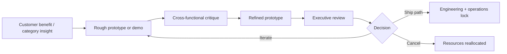
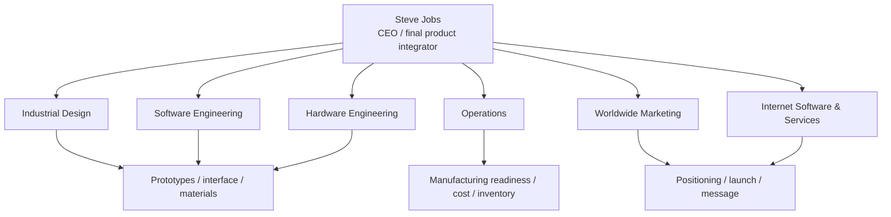

# Steve Jobs and ’s Product Operating System

## Executive Summary

Steve Jobs’s core product skill was not just vision. It was operating as a **relentless editor-in-chief of a tightly integrated product system**: he reduced portfolios to a few bets, insisted on starting with the customer experience and working backward to technology, used prototypes and recurring reviews to force clarity, and relied on a small circle of domain experts to turn taste into shippable products. The recurring pattern across the Macintosh, iPod, iPhone, iPad, and the software/services layers around them was: **generate options, compress complexity, make a few irreversible choices, and then align design, engineering, operations, marketing, and launch theater around the chosen path**. citeturn42view0turn39view0turn33view0

Jobs also did not run product the way most contemporary PM organizations do. Public evidence suggests he did **not** rely on focus groups to define the roadmap; instead, he used customer empathy, technical literacy, selective metrics, and direct observation of what made a product feel fast, trustworthy, legible, and inevitable. His most consistent “KPIs” were not generic dashboard numbers but user-facing thresholds: boot time, battery life, storage capacity, sync speed, weight and thickness, app quality, reliability, inventory discipline, and launch readiness. This made Apple unusually strong at product categories where the winning move was **integration plus taste**, not modular optimization. citeturn38search4turn39view2turn34search0turn2search10turn41search1turn20search14

The senior lieutenants mattered enormously. **entity["people","Jony Ive","apple designer"]** translated Jobs’s taste into form, materials, and human interface choices; **entity["people","Tim Cook","apple operations leader"]** made bold vision manufacturable and profitable; **entity["people","Phil Schiller","apple marketing executive"]** shaped product positioning and launch narratives; **entity["people","Scott Forstall","apple software executive"]** drove the software architecture and interaction model of iPhone-era computing; **entity["people","Tony Fadell","ipod creator"]** brought entrepreneurial systems thinking to portable devices; **entity["people","Bob Mansfield","apple hardware executive"]** ensured hardware integration and engineering coherence; **entity["people","Eddy Cue","apple services executive"]** turned stores, media, and services into strategic complements; and figures such as **entity["people","Jon Rubinstein","apple hardware leader"]**, **entity["people","Avie Tevanian","apple software architect"]**, and **entity["people","Bertrand Serlet","apple software executive"]** provided the component bets and operating-system foundations that made Jobs’s big bets real. Their differences from Jobs were often the point: they contributed depth, patience, systems thinking, operations, or commercial negotiation where Jobs contributed synthesis, priority, taste, and force. citeturn16search2turn15search0turn11search3turn14search1turn18search1turn18search0turn17news44

| Dimension | Bottom-line finding | Evidence |
|---|---|---|
| Portfolio strategy | Jobs repeatedly narrowed scope so a few products could become excellent rather than many products becoming mediocre. | citeturn42view0turn40news26turn40news27 |
| Product architecture | He preferred end-to-end control when it accelerated user experience and time-to-market. | citeturn42view0 |
| Development method | Apple ran on prototypes, demos, frequent review, and “no surprise” executive oversight. | citeturn39view1turn9search15turn24search8 |
| Org model | Jobs remade Apple into a functional organization under one P&L, with experts leading experts. | citeturn39view0turn42view0 |
| Decision style | He resisted letting focus groups write the roadmap and instead used judgment, customer-backward reasoning, and technical understanding. | citeturn38search4turn39view2turn42view0 |
| Leadership leverage | Jobs’s “genius” was amplified by senior lieutenants with unusually strong domain ownership. | citeturn16search2turn15search0turn11search3turn14search1turn18search1 |

## The Product Method

Jobs’s clearest public description of his method came after his 1997 return. In the entity["sports_event","WWDC","apple developer conference 1997"] Q&A that year, he argued that Apple needed a “pretty clear strategy” around “some really great products,” and then defined focus not as saying yes but as saying no—repeatedly. In the same session, he explained that Apple’s path should begin with “what incredible benefits can we give to the customer?” rather than with whatever technology engineers happened to have available, and he defended vertical integration as a way to “implement a vision much faster” when hardware, software, user experience, and marketing are aligned. That combination—**great products, customer-backward reasoning, no-compromise focus, whole-widget integration**—is the shortest high-confidence summary of how Jobs ran product development. citeturn42view0

His relationship to research was nuanced rather than anti-customer. Jobs mocked the idea that Apple built products by “analyz[ing] the market” and “talk[ing] to buying-research people,” then clarified “that’s not us.” Elsewhere, he said innovation has little to do with R&D spending and much more to do with the people you have and how they are led; similarly, he argued that products are hard to design by focus groups because people often do not know what they want until they see it. The pattern here is not contempt for customers; it is a refusal to let survey instruments substitute for product judgment. Apple still observed customers, watched trends, and learned from installed-base behavior—but Jobs treated that as **input to editorial judgment**, not as roadmap authority. citeturn39view2turn38search4

A second recurring decision pattern was **broad exploration followed by abrupt commitment**. The iPhone is the clearest example. Internal accounts from Forstall and Fadell agree that Apple explored multiple paths: one that extended the iPod toward a phone, another that adapted desktop-class software and multitouch into a new mobile computer. Jobs also accepted an initially constrained launch posture—no general-purpose native third-party apps—in part for schedule, security, and reliability reasons, then reversed course once Apple had a viable SDK and distribution model. In other words, Jobs could be dogmatic about standards but flexible about sequence: Apple often launched the first coherent version of a product, then opened the platform when control mechanisms existed. citeturn39view2turn11search3turn12news34turn12search11turn19search2

The best way to reconstruct Jobs’s KPI stack is therefore by looking at what he publicly obsessed over and what insiders say got reviewed. The table below separates **publicly evidenced metrics** from broader analytical inference.

| Metric family | What Jobs appeared to optimize | Why it mattered | Evidence |
|---|---|---|---|
| Focus and portfolio count | Fewer active bets, fewer distractions, clearer resource allocation | Enabled great products rather than many unfinished ones | 1997 focus doctrine; Newton and clone cuts citeturn42view0turn40news26turn40news27 |
| Time-to-value | Boot time, setup friction, sync speed | Jobs treated saved user-seconds as compounded human value | Mac boot-time anecdote; FireWire sync on iPod citeturn34search0turn2search10 |
| Battery and portability | All-day-enough battery, acceptable weight/thickness | Mobile products had to feel liberating, not fragile or annoying | iPod 10-hour battery; iPad’s 0.5-inch, 1.5-pound pitch citeturn2search10turn41search1 |
| Capacity translated into a human promise | “1,000 songs,” hundreds of apps, millions of downloads | Jobs preferred memorable benefit metrics over engineering trivia | iPod launch; App Store opening and early download numbers citeturn2search10turn19search1turn19search7 |
| Reliability and trust | Safe, reliable software; controlled distribution where needed | Especially crucial for phones and app platforms | Jobs’s security rationale for a closed launch; SDK/App Store framing citeturn39view2turn19search2turn19search1 |
| Performance and quality | Product responsiveness and underlying software quality | Apple sometimes paused feature races to improve foundations | Snow Leopard explicitly prioritized performance and quality over feature count citeturn19search6 |
| Operational discipline | Inventory, margin, manufacturing readiness | Protected product economics and launch credibility | Apple touted industry-low inventory levels during the turnaround; Cook’s role was operations at the center of execution citeturn20search14turn6search15 |
| Adoption signals | Sales velocity, app downloads, ecosystem activity | Confirmed that the integrated system—not just the device—was working | iPad first-day/first-month sales; App Store download cadence citeturn41search16turn41search14turn19search7 |

The inference from those data points is that Jobs did **not** manage product primarily through abstract KPI dashboards. He managed by a small set of hard thresholds—does it feel fast, does it last long enough, is the interface intuitive enough, is the ecosystem ready, can we manufacture it at quality and margin, and can we explain it in a sentence. That is a very different product-management philosophy from modern “measure everything” cultures, and it helps explain why Apple under Jobs excelled in step-function category shifts rather than incremental optimization wars. citeturn34search0turn2search10turn19search6turn20search14turn39view2

The method can be represented as a review-and-selection loop rather than a linear specification handoff. Insider accounts from Apple design leaders and engineers repeatedly describe a culture in which ideas had to become demos quickly and then survive dense critique. citeturn39view1turn24search8turn9search15

## Organization, Culture, and Process

Jobs’s most durable organizational move was to replace Apple’s old business-unit logic with a **functional organization under one P&L**. The later Harvard Business Review account by Apple University leaders describes the basic architecture: after Jobs returned in 1997, he put the company under a single profit-and-loss statement and combined disparate business-unit departments into one functional organization. The same account characterizes the model as “experts leading experts.” That is an unusually important fact because it explains why Apple’s product leaders were heads of functions—design, software, hardware engineering, operations, marketing, services—rather than mini-CEOs of standalone product lines. citeturn39view0

That structure only worked because Apple also developed a **high-frequency review culture**. Design-review accounts from former Apple design leaders describe a rigid weekly cadence: Monday planning, Tuesday full-team critique, midweek iteration, Thursday review again, and Friday executive review—effectively forcing people to show work every 48 hours. Baxley’s summary, “Never surprise Steve Jobs,” is revealing. The point was not theatrical approval at the end; it was continuous visibility so that major decisions emerged from many small confrontations with the work. This squares with Jony Ive’s long-running description of Apple design as a tight loop among designing, prototyping, and making, not as a relay race between separate departments. citeturn39view1turn9search15turn9search11

Cross-functional collaboration at Apple was unusually intimate by large-company standards. Apple’s own 2016 design book announcement said the products were the result of a “profoundly close collaboration between many different groups,” and the Mac retrospective from the Steve Jobs Archive depicts the original Macintosh team precisely this way: talented individuals from different disciplines building something stronger together than any one could make alone. Jobs’s product system therefore looked centralized from the outside but was actually **densely collaborative inside functions and across them**—with centralization happening at the point of final selection, not at the point of idea generation. citeturn32search10turn33view0

Secrecy was the shadow side of that model. Apple’s culture used compartmentalization, NDAs, hidden prototypes, and tightly controlled information distribution both to protect inventions and to preserve launch surprise. When Apple later dropped the iPhone developer NDA for released software, it explicitly stated that the original NDA had been created to protect Apple inventions and innovations from theft. Reporting on Apple’s broader culture likewise described aliases, canary traps, and extreme leak control. Secrecy was therefore not mere mystique; it functioned as a product tool. It reduced premature external pressure, prevented portfolio drift, and made public launches disproportionately powerful. citeturn21news39turn26news44

Jobs’s culture and hiring practices were similarly product-centric. The Steve Jobs Archive’s Mac retrospective shows him pushing the team hard, protecting it, insisting that makers “sign their work like artists,” and simultaneously reminding them they were building a tool for others. Other insider accounts say Jobs treated recruiting as a CEO-level responsibility and screened for mission fit—whether candidates could “fall in love with Apple”—not just for résumé polish. His Top 100 offsite reinforced the same value system: the most important people were not simply the highest-ranking people, but the people most critical to Apple’s future in a given year. That combination—**artist ethos, intolerance for mediocrity, mission-first recruiting, and contribution over title**—was one of the company’s deepest product advantages. citeturn33view0turn26search6turn22search14

The operating logic can be sketched as a functional hub rather than a product-division chart. citeturn39view0turn16search2turn15search0turn14search1

## Product Case Studies

What follows is not a complete history of each product; it is a reconstruction of the **product move, key trade-off, and institutional pattern** that each case reveals.

| Product or layer | Core product problem | Jobsian move | Main trade-off or cancellation logic | Principal lieutenants | Evidence |
|---|---|---|---|---|---|
| Macintosh | Computers were powerful but intimidating; Apple wanted a mass-market machine that felt humane | Humans-first GUI, “computer for the rest of us,” artist-engineer team, signatures inside the machine | Radical ease-of-use required intense deadline pressure and centralized taste | Early Mac team under Jobs; later OS heirs built on the template | citeturn33view0turn27view0 |
| macOS from Mac OS X | Apple needed a modern OS foundation after years of drift | Rebuild on a UNIX-based core with Mac ease-of-use, then make it the default; later use Snow Leopard to improve performance and quality | Required abandoning old paths and accepting painful transition costs | Tevanian, Serlet, later Federighi; Forstall and Safari team were important near the edge | citeturn31search7turn31search10turn19search6turn31search5turn18search1turn18search0 |
| iPod plus iTunes | Digital music was fragmented, clumsy, and badly synchronized across devices and PCs | Combine simple desktop software with a portable device pitched in human terms: 1,000 songs, 10-hour battery, fast FireWire sync | Early Mac-first ecosystem and tight control limited openness but improved coherence | Rubinstein, Fadell, Schiller, Cue | citeturn2search10turn17news44turn12search4turn15search0 |
| iPhone and iOS | Existing smartphones were compromised by keyboards, carrier control, and poor software | Choose multitouch pocket computer over the simpler “iPod phone” path; keep design control against carrier norms | Launch closed for security, reliability, and schedule reasons; open later when the SDK and store model were ready | Forstall, Fadell, Ive, Schiller, Cue | citeturn39view2turn11search3turn12news34turn19search2 |
| App Store | Apple needed third-party innovation without turning the iPhone into unmanaged PC-style complexity | Native SDK plus curated distribution and review | Safety and quality were prioritized, but friction and gatekeeping became structural tensions | Forstall, Schiller, Cue | citeturn19search2turn19search1turn19search7turn15search0turn16search2 |
| iPad | There was space between phone and laptop if touch computing could become simpler and more intimate | Reuse the multitouch/software ecosystem, then pitch a new category around directness, thinness, and immediate usefulness | Ambiguity about “what it is for” was solved by apps, media, and sales momentum rather than by one killer use case | Jobs with the iPhone-era stack of design, software, hardware, services | citeturn41search1turn41search16turn41search14 |
| Apple Watch | After Jobs, Apple still needed a route into wearables that preserved Apple’s taste for tightly integrated categories | Make the watch “the most personal device” with a new small-screen UI and the Digital Crown | Successor-era Apple initially emphasized personalization and fashion; over time the strategic center of gravity shifted more toward health and utility | Ive, Cook, Cue and the post-Jobs leadership system | citeturn35search2turn15search0turn26news39 |

The cases also reveal a striking asymmetry in Jobs’s trade-offs. He was more willing to **cancel entire businesses** than to ship products that violated the future architecture he wanted. Ending the Mac clone program concentrated economics and experience back inside Apple’s integrated model; killing Newton freed attention for the Mac reset and, later, for a cleaner return to mobile computing on Jobs’s terms. Conversely, when he believed a category would matter but the architecture was not ready, he often delayed or narrowed functionality rather than abandoning the ambition—hence the iPhone’s web-apps-first launch and later SDK reversal. citeturn40news27turn40news26turn39view2turn19search2

The strongest throughline is that Jobs did not see hardware, software, or services as separate products. The iPod only became historically decisive when paired with iTunes; the iPhone only became a defensible platform when software tools and the store arrived; the iPad inherited the iPhone app ecosystem; Apple Watch inherited both the hardware-design tradition and the services logic. In modern product language, Jobs repeatedly won by building **stacks**, not SKUs. citeturn2search10turn19search2turn19search7turn41search14turn35search2

## The Senior Lieutenants

Jobs’s lieutenants were not interchangeable executors. They were **expert specialists inside a system built to force expert argument**. HBR’s description of Apple’s model as “experts leading experts” is the right frame: Jobs selected domains, compressed priorities, and made final calls, but the substance of each category lived in unusually strong functional leaders. citeturn39view0

| Leader | Domain genius | Signature product instincts and contributions | How this complemented Jobs | How this differed from Jobs | Evidence |
|---|---|---|---|---|---|
| **entity["people","Jony Ive","apple designer"]** | Industrial design, materials, object integrity, human interface framing | Turned Apple products into coherent physical arguments about simplicity, craft, and inevitability; central across iMac, iPod, iPhone, iPad, and Watch | Gave form to Jobs’s taste and helped make prototypes persuasive enough to decide from | Quieter, more makerly, more rooted in materials and prototyping than in confrontation or portfolio politics | citeturn7search0turn9search11turn9search15turn35search2 |
| **entity["people","Tim Cook","apple operations leader"]** | Operations, supply chain, launch discipline, economic fitness | Made Apple’s product ambitions manufacturable at scale and with strong margins; operations became a product advantage, not a back-office function | Converted Jobs’s taste-led bets into repeatable, profitable execution | More process- and system-oriented, less visibly taste-theatrical; later emphasized stewardship and culture | citeturn6search15turn20search14turn26news39 |
| **entity["people","Phil Schiller","apple marketing executive"]** | Product marketing, category framing, launch message, competitive positioning | Helped shape the public narrative of Mac, iPod, iPhone, App Store, and iPad; later led the App Store | Ensured that Apple’s products were not only great but legible in one sentence on launch day | More outward-facing and market-facing than Jobs; a translator and defender as much as a decider | citeturn16search2turn39view2turn17news44 |
| **entity["people","Scott Forstall","apple software executive"]** | Mobile software systems, interaction design, platform architecture | Led iPhone and iPad software and helped enable apps and the App Store | Supplied the deep software craft that let Jobs treat the phone as a computer, not a handset | More software-first; his strength was internal software leadership rather than whole-company synthesis | citeturn11search2turn11search3turn19search2 |
| **entity["people","Tony Fadell","ipod creator"]** | Portable-device architecture, systems thinking, hardware pragmatism | Oversaw the first iPod and early iPhone hardware development; emphasized fast convergence of components, cost, and user story | Injected entrepreneurial urgency and end-to-end device logic into the music and phone roadmaps | More explicit about trade-offs, component feasibility, and shipping pragmatism than Jobs’s broader editorial role | citeturn12search4turn13search4turn12news34 |
| **entity["people","Bob Mansfield","apple hardware executive"]** | Hardware integration and engineering steadiness | Led Mac hardware, later iPad hardware from introduction, and eventually iPhone/iPod hardware teams | Stabilized the engineering side of Apple’s ambition and translated design targets into reliable systems | Lower-profile and less public; his value was coherence more than narrative | citeturn14search1turn14search11 |
| **entity["people","Eddy Cue","apple services executive"]** | Online commerce, media/service deals, ecosystem infrastructure | Instrumental in the online store, iTunes Store, App Store, and later service layers | Added the services and distribution pieces that turned devices into businesses | More commercial and partnership-oriented; focused on service plumbing and content relationships | citeturn15search0 |
| **entity["people","Jon Rubinstein","apple hardware leader"]** | Hardware leadership, component selection, feasibility judgment | Key figure in iPod creation and trusted hardware leadership during Jobs’s return era | Brought the component, platform, and feasibility intelligence that underwrote Jobs’s category bets | More architecture- and parts-driven; less involved in the external product theater | citeturn17news44turn42view0 |
| **entity["people","Avie Tevanian","apple software architect"]** and **entity["people","Bertrand Serlet","apple software executive"]** | Operating-system foundations and deep software architecture | Tevanian set company-wide software directions; Serlet led OS engineering and the long arc from Mac OS X to later refinements | Gave Jobs the software substrate for the second Apple era | More platform-deep and less category-marketing oriented | citeturn18search1turn18search0 |

The crucial analytical point is that these leaders did not merely “support” Jobs. Their approaches **complemented his blind spots**. Jobs was an extraordinary judge of product coherence, sequencing, and taste, but Apple also needed hard-nosed operational economics, platform engineering, service negotiations, and launch storytelling. When these people matched his standards, Apple looked magical because multiple types of excellence converged at once. When the system slipped—through platform friction, service failures, or internal political breaks—the weakness usually appeared at the seams between those domains. citeturn39view0turn15search0turn16search2turn11search3

## Timeline of Major Decisions and Turning Points

| Year | Turning point | Why it mattered for product strategy | Evidence |
|---|---|---|---|
| 1981 | Jobs took over the Macintosh effort | Began the small-team, artist-engineer, high-pressure model that later became Apple mythology | citeturn33view0 |
| 1984 | Macintosh launched | Established graphical, human-centered computing as Apple’s defining product thesis | citeturn33view0turn27view0 |
| 1997 | Jobs returned and articulated focus, customer-backward reasoning, and end-to-end design control | Reset Apple from sprawling experimentation to a few great products | citeturn42view0turn39view0 |
| 1997 | Mac clone strategy was effectively ended | Reasserted the whole-widget model and concentrated economics back inside Apple | citeturn40news27 |
| 1998 | Newton was cancelled | Showed Jobs’s willingness to kill products that did not fit the reduced portfolio and future architecture | citeturn40news26 |
| 2001 | Mac OS X shipped | Put the modern software foundation in place for later Mac and mobile products | citeturn31search7turn31search10 |
| 2001 | iTunes and iPod launched | Turned “digital hub” logic into a hardware-software system with a simple human promise | citeturn32search8turn2search10 |
| 2003 | Safari and iTunes Store matured Apple’s software/services layer | Showed that Apple’s platform strategy would include first-party apps and commerce, not just devices | citeturn31search5turn15search0 |
| 2007 | iPhone launched as a closed, tightly integrated product | Reframed the phone as a software-defined computer while protecting reliability and schedule | citeturn39view2 |
| 2008 | SDK and App Store opened the platform | Apple shifted from product to platform while keeping curation and control | citeturn19search2turn19search1turn19search7 |
| 2008 | Snow Leopard prioritized performance and quality over feature volume | Demonstrated Apple’s willingness to pause feature racing in favor of foundation work | citeturn19search6 |
| 2010 | iPad launched and scaled rapidly | Converted multitouch into a broader computing category and leveraged the app ecosystem | citeturn41search1turn41search16turn41search14 |
| 2014 | Apple Watch launched under Jobs’s successors | Showed that Apple had partially institutionalized Jobs’s product system beyond his direct management | citeturn35search2turn26news39 |

Viewed as a sequence, the timeline shows two alternating moves. First, Jobs **cut**: clones, Newton, dead-end technologies, excess projects. Second, he **stacked**: OS foundation, desktop software, portable hardware, phone platform, app distribution, wearables. The cuts created concentration; the stacks created compounding advantage. That alternation is one of the clearest signatures of his product strategy. citeturn42view0turn40news26turn40news27turn19search2turn35search2

## Communication, Presentation, and Strategic Influence

Jobs’s communication style was part of the product system, not decoration around it. In 1997 he told developers that Apple should talk about “great products,” “great customers,” and “great applications,” and he dismissed the idea that Apple could advertise itself back into relevance before the products proved it. That stance helps explain why Apple launches under Jobs were so product-dense: the keynote was not meant to compensate for product weakness but to **compress the product’s logic into a memorable narrative**. citeturn42view0

His public presentation technique had a recognizable grammar. He favored simple contrasts, memorable benefits, plain adjectives, and triadic reveals. The original iPhone keynote’s “an iPod, a phone, an Internet communicator” structure is the most famous example; the 2005 commencement address at **entity["organization","Stanford University","university"]** used three personal stories with almost no jargon. Insider accounts from design and software teams show that this apparent spontaneity rested on intense rehearsal. Kocienda’s account of Jobs’s process emphasizes weeks of rehearsal, repeated refinement of lines, slides, pace, and gesture, while Apple’s internal design-review rhythm shows the same bias toward early exposure and progressive refinement. Presentation, in other words, mirrored product development: **demo early, revise often, and remove ambiguity before the audience sees it**. citeturn23search4turn23search2turn23search8turn23search11turn39view1

Jobs also communicated by converting product principles into compact moral language. He framed focus as saying no; he framed integration as the ability to move faster than the industry; he framed design not as decoration but as the route to products people could immediately understand. Fadell’s later account of what he learned from Jobs about storytelling is telling here: Jobs could marshal fact and emotion together so that the story of the product and the reasons it had to exist became inseparable. That made Apple’s launches unusually effective at aligning employees, media, customers, partners, and developers around the same interpretation of the product. citeturn42view0turn13search0

His long-run influence on product strategy was therefore institutional as much as personal. Cook later argued that Jobs’s greatest gift to the world was Apple itself and its culture, not one individual device. That claim is plausible in the narrow product sense. The post-2011 Apple Watch, the persistence of a functional org, the continued centrality of design and services, and the ongoing preference for integrated stacks over modular bargaining all suggest that Jobs left behind a reproducible operating system for product creation—even if no successor has replicated his exact combination of taste, force, and showmanship. The deepest strategic legacy was not “make beautiful gadgets.” It was **build an organization that can repeatedly turn judgment into integrated products**. citeturn26news39turn39view0turn35search2

## Open Questions and Limitations

Some parts of this history remain structurally opaque because Apple’s internal process was deliberately secretive. Exact KPI dashboards, many review artifacts, and the full contribution map for major products are not public, so parts of the analysis above are reconstructions from speeches, interviews, leadership bios, Apple press releases, and insider accounts rather than from internal documents. Likewise, post-2011 products such as Apple Watch can be analyzed confidently as extensions of the Jobsian system, but less confidently as direct expressions of Jobs’s own day-to-day product management. Finally, Apple’s products were built by shared teams under strong secrecy norms, so disputes about who “really invented” particular features or formulations should be treated cautiously. citeturn21news39turn26news44turn35search2

The highest-confidence conclusion, however, is clear: Steve Jobs’s product genius was **systemic**. He combined ruthless prioritization, customer-backward reasoning, integrated architecture, repeated prototype review, theatrical communication, and a bench of expert lieutenants into a single operating model. That is why the best way to understand his “product skills” is not as a list of personality traits, but as a coherent method for turning taste and technology into categories that felt obvious only after Apple shipped them. citeturn42view0turn39view0turn33view0turn39view2